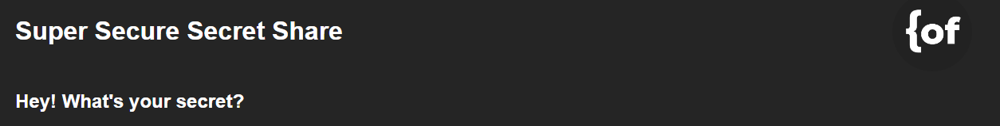
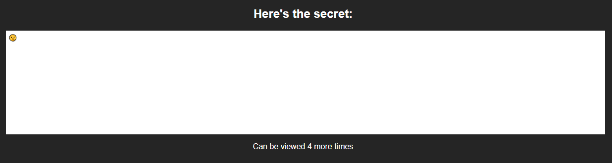

# About Secret Share

Ever wanted to ask a client for a password to their account? Need to get an access code but don't want it stuck in some email log? Use this. Using Secret-Share you can send a link containing the secret you want to share. Once you're done with a secret, it's gone. 

# Get Started

This program is built using Go, so you'll need to build and host it.

Your first step is to navigate to the `./frontend` folder in the terminal. From there, run `npm install` to install all Vue.js dependencies.

Next, navigate back to the project root and run the `./build.sh` script. Finally, put the binary that makes sense for your server out there. Run it as a systemd script, inside of `shell` or however windows works.

# Linking Emails

To secret share via email you'll have to add emails to the `.env` file. Just add them to the `RECIPIENTS` variable and that's it! It should look something like this:

`RECIPIENTS=John:john@example.com,Jane:jane@example.com`

# Start Sharing!

Now you'll be able to send secrets! They can either be directly emailed to someone, or you can send to "Nobody" and send the link however you'd like.
